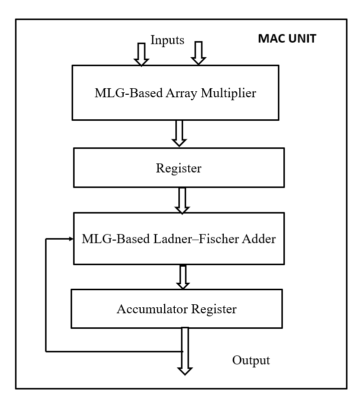
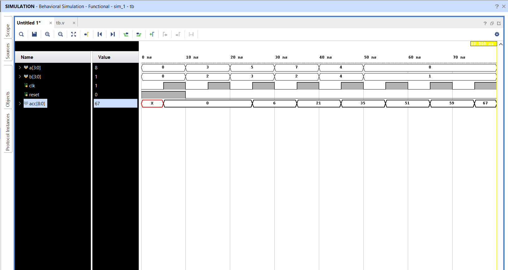
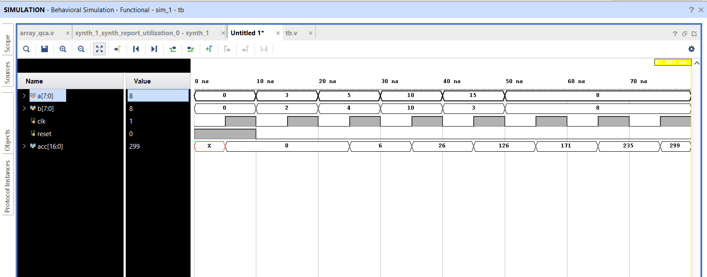
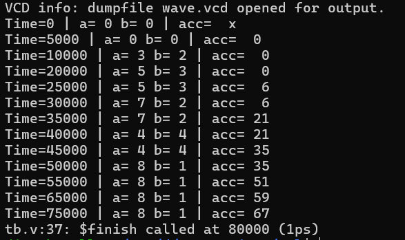
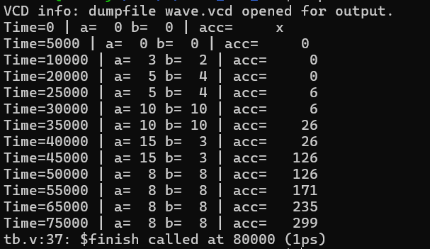
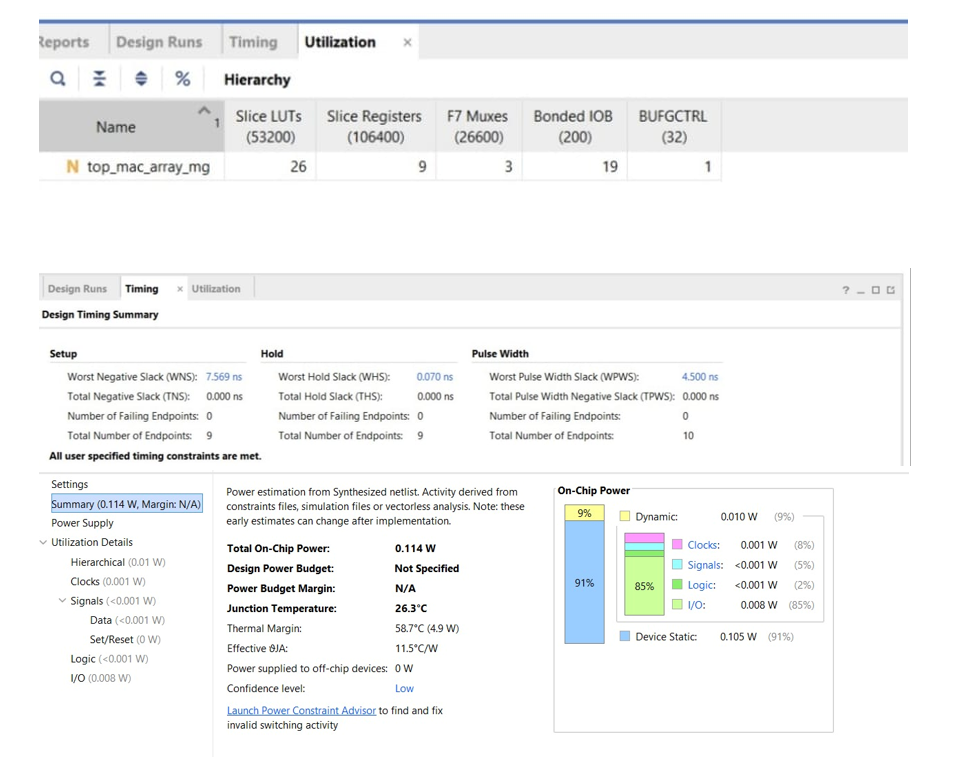
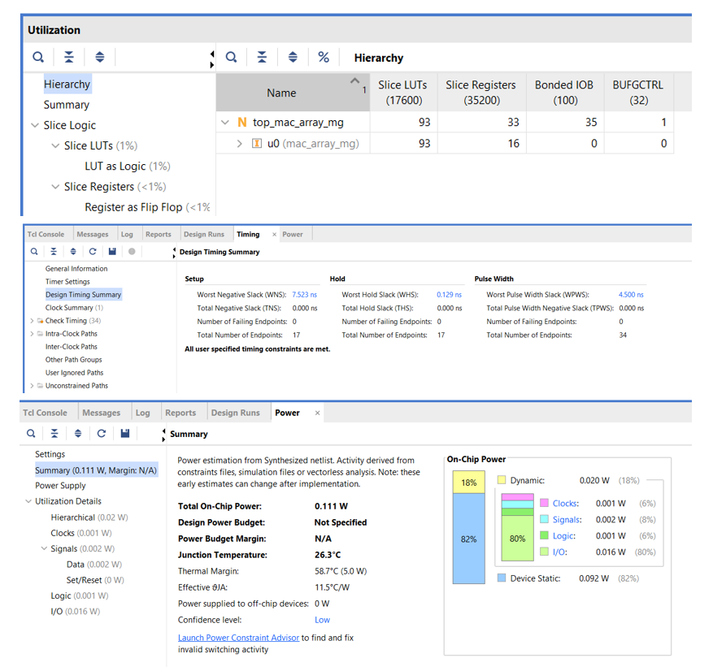
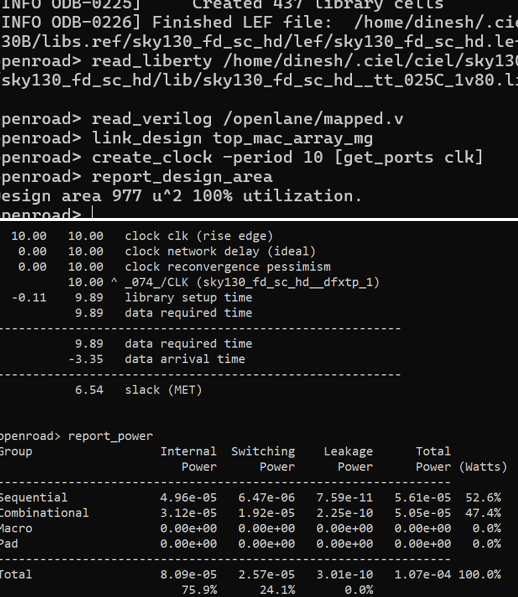
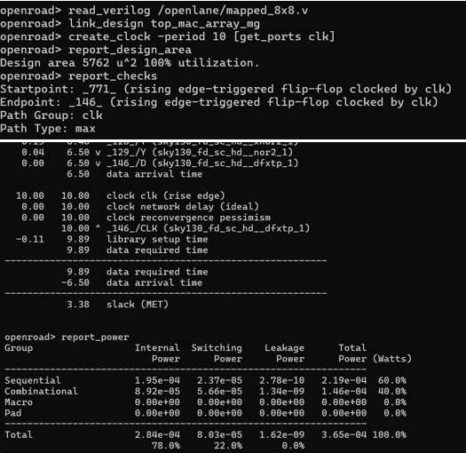

# Design and Synthesis of Majority Logic Gate Based MAC Units with FPGA and ASIC Evaluation

## Overview

This project presents the design and synthesis of Majority Logic Gate (MLG) based Multiply-Accumulate (MAC) units for digital signal processing applications. The work focuses on implementing 4×4 and 8×8 MAC architectures using Majority Logic Gate based full adders and evaluating their performance through FPGA and ASIC design flows.

The designs were developed using Verilog HDL, verified through simulation, synthesized using Xilinx Vivado for FPGA evaluation, and analyzed using the SKY130 standard-cell library through Yosys and OpenROAD for ASIC evaluation.

---

## Published Research Paper

**Title:** Design and Synthesis of Majority Logic Gate Based MAC Units with FPGA and ASIC Evaluation

**Publication:** IRJET (International Research Journal of Engineering and Technology)

📄 **Published Paper**

[View Paper](Paper/IRJET-V13I04127.pdf)

---

## Project Architecture

### Overall MLG-Based MAC Architecture

  

The proposed architecture consists of:

- Majority Logic Gate (MG)
- QCA-Based Full Adder
- Array Multiplier Structure
- Register Stage
- Accumulator Unit
- MAC Processing Pipeline

---

## RTL Design

### 4×4 MAC Unit

Implemented Modules:

- Majority Logic Gate (MG)
- QCA Full Adder
- Array Multiplier
- Register Unit
- MAC Architecture
- Ladner-Fischer Adder Based Design

### 8×8 MAC Unit

Implemented Modules:

- Majority Logic Gate (MG)
- QCA Full Adder
- 16-bit MLG Adder
- Array Multiplier
- Register Unit
- MAC Architecture

---

# Functional Verification

Simulation and verification were performed using **Icarus Verilog**.

## 4×4 MAC Functional Verification

  

---

## 8×8 MAC Functional Verification

  

---

## 4×4 MAC ASIC Verification

  

---

## 8×8 MAC ASIC Verification

  

---

# FPGA Evaluation

## FPGA Design Environment

- Tool: Xilinx Vivado
- FPGA Family: Xilinx Zynq-7000
- Device: XC7Z010CLG400-1

## FPGA Synthesis Results

| Design | LUTs | Delay (ns) | Power (W) |
|----------|----------|----------|----------|
| 4×4 MAC | 26 | 2.431 | 0.114 |
| 8×8 MAC | 93 | 2.566 | 0.111 |

### 4×4 FPGA Results

  

---

### 8×8 FPGA Results

  

---

# ASIC Evaluation

## ASIC Design Flow

- RTL Design using Verilog HDL
- Logic Synthesis using Yosys
- Standard Cell Mapping using SKY130 Library
- Physical Analysis using OpenROAD

## ASIC Results

| Design | Area (µm²) | Delay (ns) | Power (µW) |
|----------|----------|----------|----------|
| 4×4 MAC | 997 | 3.35 | 107 |
| 8×8 MAC | 5762 | 6.50 | 365 |

### 4×4 ASIC Results

  

---

### 8×8 ASIC Results

  

---

# Key Achievements

✅ Designed custom Majority Logic Gate based 4×4 and 8×8 MAC architectures using Verilog HDL

✅ Developed Majority Logic Gate Full Adders and integrated them into MAC datapaths

✅ Achieved FPGA synthesis results of:
- 26 LUTs and 2.431 ns delay for 4×4 MAC
- 93 LUTs and 2.566 ns delay for 8×8 MAC

✅ Evaluated ASIC implementations using SKY130 technology:
- 997 µm² area and 107 µW power for 4×4 MAC
- 5762 µm² area and 365 µW power for 8×8 MAC

✅ Performed complete RTL verification using Icarus Verilog

✅ Executed ASIC synthesis and physical analysis using Yosys and OpenROAD

✅ Published the research work in IRJET

---

# Tools Used

- Verilog HDL
- Icarus Verilog
- Xilinx Vivado
- Yosys
- OpenROAD
- OpenLane
- SKY130 Standard Cell Library

---

---

# Author

### Dinesh Vardhan Dundi

B.Tech – Electronics and Communication Engineering

### Research Interests

- VLSI Design
- Digital IC Design
- FPGA Design
- ASIC Design
- Hardware Accelerators
- Neuromorphic Computing
- DSP Architectures

---

## Citation

If you use this work in your research, please cite the associated IRJET publication.
